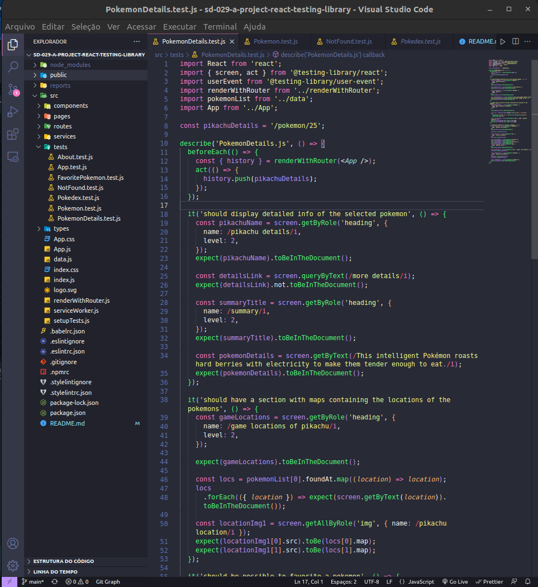
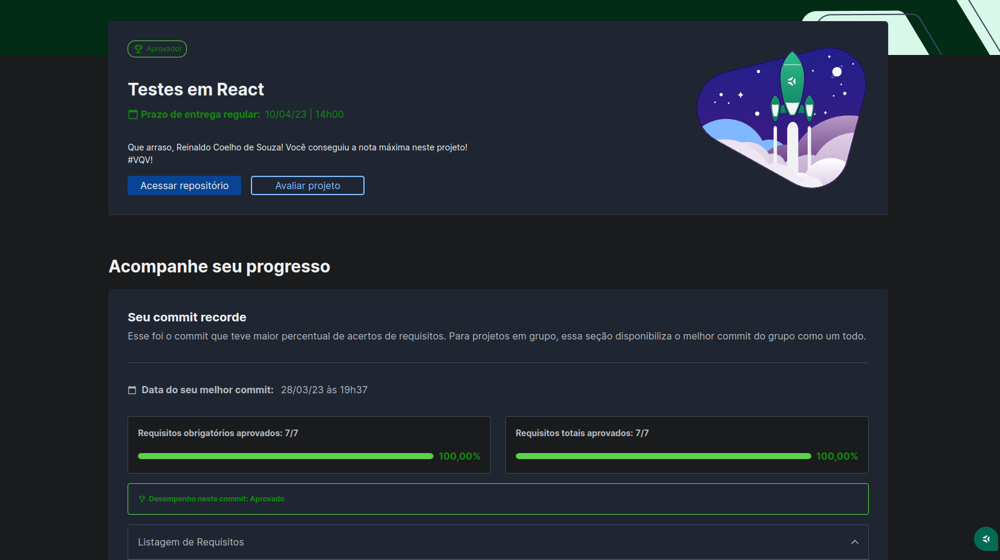

# 🧪 React Testing Library Project

## 📘 Sobre

Desenvolvi testes usando Jest e a biblioteca React Testing Library para uma aplicação de Pokedéx.

## ⚛️ Habilidades

Projeto construído utilizando React.js.

- Seletores da biblioteca RTL;
- Fluxos assíncronos;
- Simulação de eventos do usuário;
- Testes de inputs.

## 🛠️ Como executar o projeto?

1. Instalando dependências

`npm install`

2. Executando a aplicação

`npm start`

3. Executando os testes

## 📝 Nota

## ©️ Copyright

- Logo "Trybetunes" - Direitos reservados à Trybe.